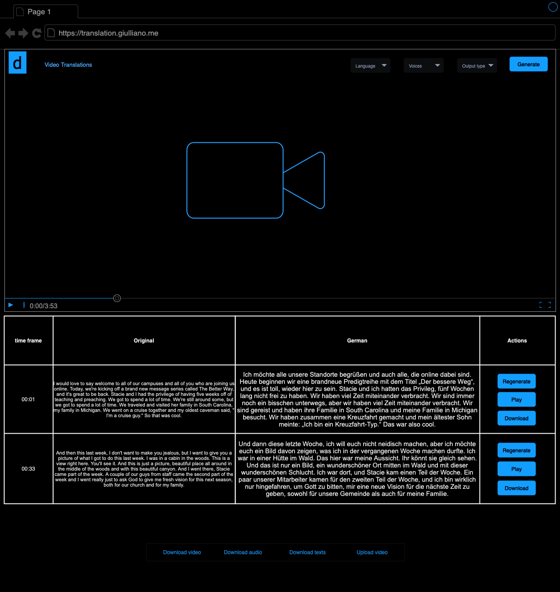

# video-translator
A web application that uses AI to translate video speeches. You can upload a video, and the application will transcribe the audio, translate the text, and allow you to edit the translation. Afterward, you can generate a voice-over in the translated language.

## Requirements
Enable the user to upload a video, edit the translation for specific time frames, and regenerate the voice-over for each edited segment.

### Video upload
Allow the user to upload a mp4 file.

### Transcription
Allow the user to edit the transcription for each time frame.

### Voice over
Allow the user to generate and regenerate a voice over for each time frame. 

#### edge cases
1. The user should be able to select which voice to use.
2. The user should adjust the audio speed to synchronize the voice-over with the rest of the speech.
3. The compiled audio, including all time frames, should automatically insert silence between segments to help synchronize the audio with the video.

#### Wireframe

This the UI wireframe without some of the edge cases.
